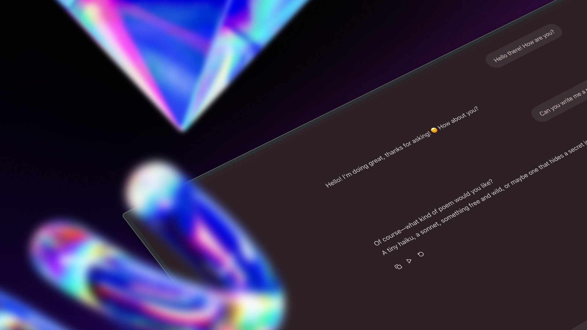

# Simple Chat Interface



A simple, clean chat interface with branching conversations, reruns, and just the essentials.

## Features

- Create conversation branches to explore different paths
- Rerun messages to get new responses
- Clean, minimal interface focused on the chat experience

## Installation

```bash
npm install
```

## Setup

You'll need to create a `.env` file in the root directory with your OpenAI configuration:

```env
NEXT_PUBLIC_OPENAI_API_KEY=your_api_key_here
NEXT_PUBLIC_OPENAI_BASE_URL=https://api.openai.com/v1
NEXT_PUBLIC_OPENAI_MODEL=gpt-4o-mini
```

> [!WARNING]
> **⚠️ Warning**: Since these are `NEXT_PUBLIC_` variables, your API key will be exposed in the client-side code. Only use this with API keys you're comfortable making public, or use a proxy/backend service instead.

## Run

```bash
npm run dev
```

## Build

```bash
npm run build
```

This will then generate a static site in the `out` directory. You can then deploy this to any static site hoster.
